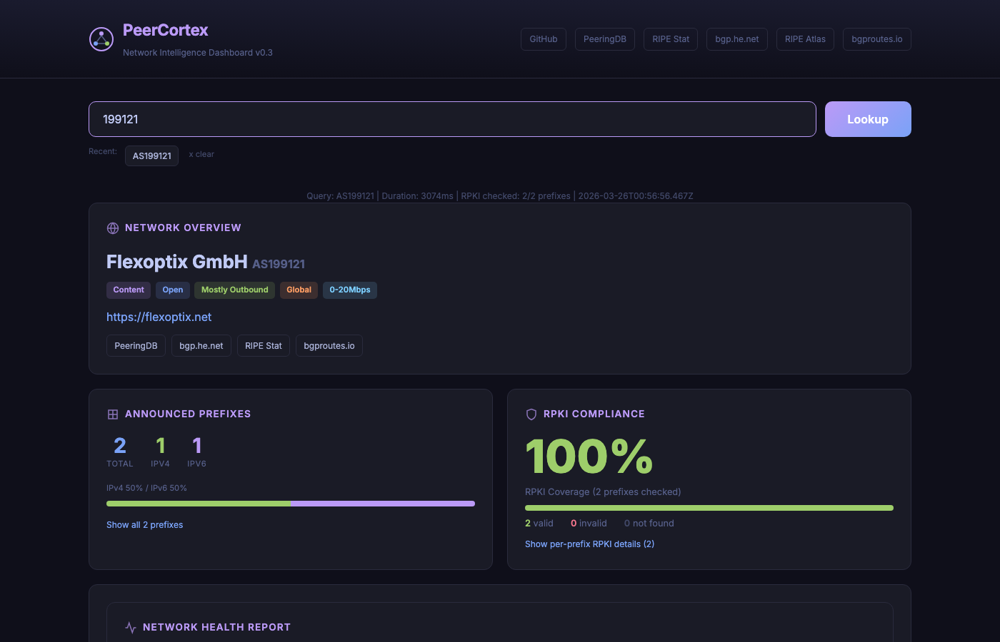
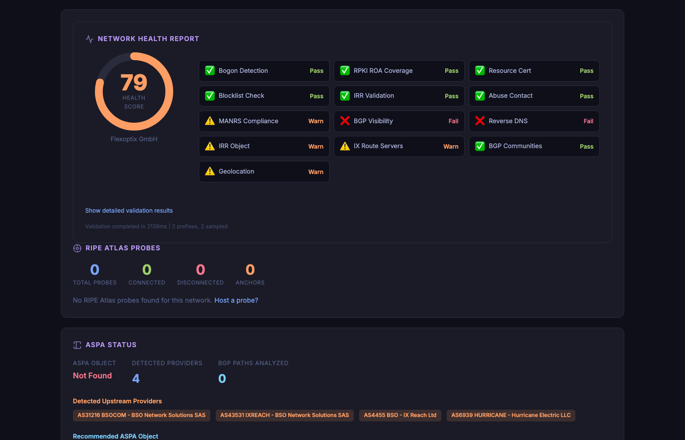
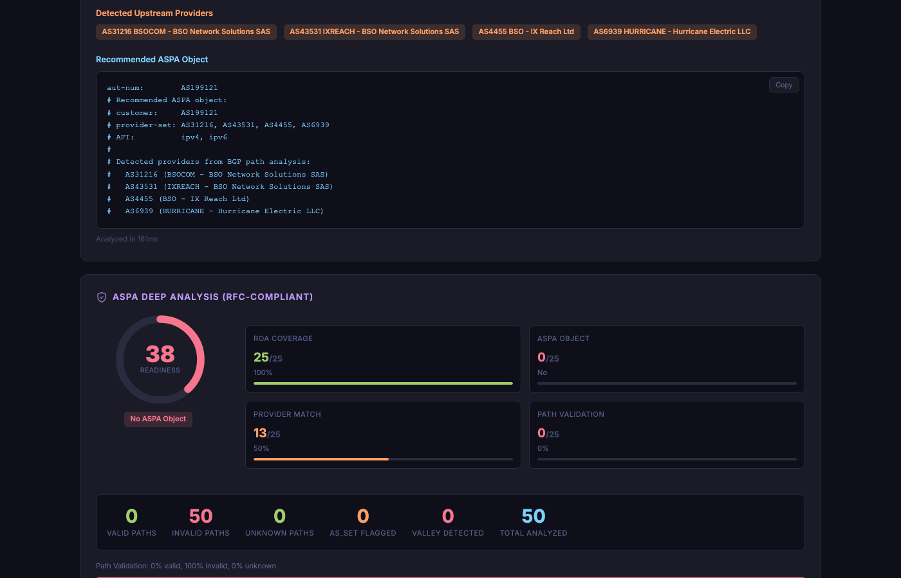
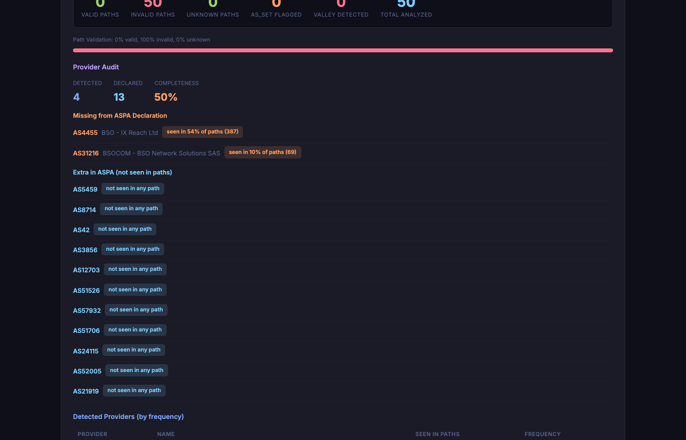
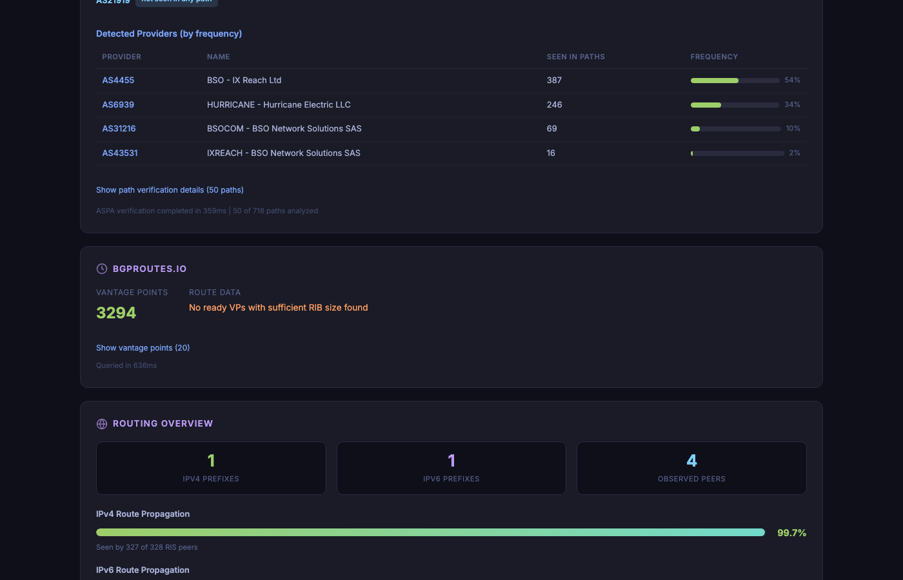

<p align="center">
  
</p>

<h1 align="center">PeerCortex</h1>
<p align="center"><strong>The AI-Powered Network Intelligence Platform</strong></p>
<p align="center">BGP Analysis &middot; Peering Intelligence &middot; RPKI Validation &middot; ASPA Verification &middot; Network Health Checks</p>

<p align="center">
  <a href="https://github.com/renefichtmueller/PeerCortex/stargazers"></a>
  <a href="LICENSE"></a>
  <a href="https://peercortex.org"></a>
  <a href="https://modelcontextprotocol.io/"></a>
  <a href="#"></a>
  <a href="https://ollama.com/"></a>
  <a href="#"></a>
  <a href="https://www.peeringdb.com/"></a>
  <a href="https://stat.ripe.net/"></a>
  <a href="https://bgp.he.net/"></a>
  <a href="https://www.docker.com/"></a>
  <a href="https://nodejs.org/"></a>
</p>

<br/>

<p align="center">
  <strong><a href="https://peercortex.org">Live Demo at peercortex.org</a></strong>
  &nbsp;&bull;&nbsp;
  <strong><a href="#quick-start">Quick Start</a></strong>
  &nbsp;&bull;&nbsp;
  <strong><a href="#mcp-server-tools">MCP Tools</a></strong>
  &nbsp;&bull;&nbsp;
  <strong><a href="#web-dashboard">Dashboard</a></strong>
  &nbsp;&bull;&nbsp;
  <strong><a href="docs/architecture.md">Architecture</a></strong>
</p>

<br/>

<p align="center">
  
</p>

<p align="center"><em>PeerCortex dashboard analyzing AS199121 — network overview, announced prefixes, RPKI compliance, and more</em></p>

---

## Table of Contents

- [What is PeerCortex?](#what-is-peercortex)
- [The Problem](#the-problem)
- [Web Dashboard](#web-dashboard)
  - [Network Overview](#network-overview)
  - [Announced Prefixes](#announced-prefixes)
  - [RPKI Compliance](#rpki-compliance)
  - [Network Health Report](#network-health-report)
  - [RIPE Atlas Probes](#ripe-atlas-probes)
  - [ASPA Status](#aspa-status)
  - [ASPA Deep Analysis](#aspa-deep-analysis)
  - [bgproutes.io Integration](#bgproutesio-integration)
  - [Routing Overview](#routing-overview)
  - [WHOIS Details](#whois-details)
  - [Network Compare](#network-compare)
  - [Peering Partner Finder](#peering-partner-finder)
- [MCP Server Tools](#mcp-server-tools)
- [Claude Code Integration](#claude-code-integration)
- [API Reference](#api-reference)
- [Data Sources](#data-sources)
- [Self-Hosting Guide](#self-hosting-guide)
  - [Docker Deployment](#option-1-docker-recommended)
  - [Node.js Installation](#option-2-local-installation)
  - [npx One-Liner](#option-3-npx-one-liner)
- [Configuration](#configuration)
- [Architecture](#architecture)
- [Privacy and Security](#privacy-and-security)
- [ASPA Intelligence](#aspa-intelligence)
- [Feature Comparison](#feature-comparison)
- [Roadmap](#roadmap)
- [Contributing](#contributing)
- [FAQ](#faq)
- [Acknowledgments](#acknowledgments)

---

## What is PeerCortex?

PeerCortex is a **self-hosted network intelligence platform** that unifies data from PeeringDB, RIPE Stat, bgp.he.net, bgproutes.io, RIPE Atlas, IRR databases, and RPKI validators into a single interface. It ships as two components:

1. **Web Dashboard** ([peercortex.org](https://peercortex.org)) — A live, interactive dashboard for instant ASN analysis with 12+ modules covering network overview, RPKI compliance, ASPA verification, health scoring, routing analysis, and more.

2. **MCP Server** — A Model Context Protocol server that exposes 25+ tools for AI-powered network analysis through Claude Code or any MCP-compatible client. Local Ollama inference means no data leaves your machine.

**Who uses PeerCortex?**

- **Network Engineers** who need a unified view across fragmented data sources
- **Peering Coordinators** who evaluate potential peering partners and track IXP presence
- **NOC Operators** who monitor BGP health, detect anomalies, and investigate incidents
- **Security Teams** who track RPKI/ASPA compliance and identify route leaks
- **RPKI Deployers** who need per-prefix validation status and coverage metrics
- **ASPA Early Adopters** who want to generate ASPA objects and verify provider declarations

---

## The Problem

Network operators juggle fragmented tools. Every task requires a different interface, a different query language, and manual correlation of results:

| Task | Without PeerCortex | With PeerCortex |
|------|-------------------|-----------------|
| ASN lookup | Open PeeringDB, RIPE Stat, bgp.he.net in separate tabs | Single query, unified results |
| RPKI compliance check | Query Routinator, match against announced prefixes, calculate coverage | Per-prefix validation with coverage percentage |
| Health assessment | Check bogons, ROAs, IRR, blocklists, MANRS, rDNS, abuse contacts... manually | 13-check automated health score in seconds |
| ASPA readiness | Manual BGP path analysis, check RIPE DB for ASPA objects, identify providers | Auto-detected providers with ready-to-submit ASPA template |
| Find peering partners | Manual PeeringDB search, filter by IX, check policies one by one | AI-ranked results with common IX and facility overlap |
| Compare two networks | Open both ASNs on PeeringDB, manually compare IX/facility lists | Side-by-side comparison with overlap analysis |
| Detect route leaks | Check RIPE RIS, cross-reference AS paths, analyze manually | Real-time ASPA-based leak detection from 3,294 vantage points |

PeerCortex collapses these multi-step workflows into single queries backed by real data from authoritative sources.

---

## Web Dashboard

The PeerCortex web dashboard is a single-page application that performs comprehensive ASN analysis. Enter any ASN and get instant results across 12+ modules, all rendered in a dark-themed, information-dense layout designed for network operators.

**Try it now:** [peercortex.org/?asn=13335](https://peercortex.org/?asn=13335)

---

### Network Overview

The Network Overview module combines data from **PeeringDB** and **RIPE Stat** into a single unified panel. At a glance you see:

- **Network identity**: ASN, name, organization, network type (NSP, Content, Enterprise, etc.)
- **Peering policy**: Open, Selective, Restrictive, or No Policy listed
- **Scope**: Regional, National, Continental, or Global
- **Contact information**: Peering email, NOC phone, policy URL
- **Registration metadata**: RIR allocation, holder name, registration date
- **Peer and neighbor counts**: Upstream providers, downstream customers, lateral peers
- **IX participation summary**: Total exchanges, total facilities
- **BGP visibility**: Percentage of RIPE RIS collectors seeing the AS

This module pulls from PeeringDB's REST API v2 for the network profile and RIPE Stat's AS Overview and ASN Neighbours data calls for routing context. The result is a single panel that replaces opening three different websites.

---

### Announced Prefixes

The Announced Prefixes module shows every prefix originated by the ASN, broken down by address family:

- **IPv4 prefix count** with individual prefix listings
- **IPv6 prefix count** with individual prefix listings
- **Prefix size distribution**: /8 through /24 for IPv4, /32 through /48 for IPv6
- **First seen / last seen timestamps** from RIPE RIS collectors

Data is sourced from RIPE Stat's Announced Prefixes data call, which reflects the current global routing table as observed by RIPE RIS route collectors distributed worldwide.

---

### RPKI Compliance

The RPKI Compliance module validates every announced prefix against ROA (Route Origin Authorization) data:

- **Per-prefix validation status**: Valid, Invalid, or Not Found
- **Overall coverage percentage**: What fraction of prefixes have valid ROAs
- **Max-length analysis**: Flags over-permissive max-length settings that could enable sub-prefix hijacking
- **Color-coded results**: Green for valid, red for invalid, yellow for not covered

PeerCortex queries RPKI validators (local Routinator if available, RIPE RPKI validator as fallback) to perform origin validation for each prefix-ASN pair. This gives operators an immediate view of their RPKI deployment completeness.

---

### Network Health Report

<p align="center">
  
</p>

<p align="center"><em>Network Health Report with 13 automated checks and a weighted health score</em></p>

The Network Health Report is one of the most comprehensive features in PeerCortex. It runs **13 independent validation checks** in parallel and calculates a weighted health score from 0 to 100:

| # | Check | What It Validates | Weight |
|---|-------|-------------------|--------|
| 1 | **Bogon Detection** | Checks all announced prefixes against RFC 5735/6890 bogon ranges (10.0.0.0/8, 192.168.0.0/16, etc.) and flags bogon ASNs (AS0, AS23456, private range 64512-65534) | High |
| 2 | **ROA Completeness** | RPKI ROA coverage across all announced prefixes with per-prefix validation | High |
| 3 | **IRR Consistency** | Cross-references BGP-announced origins against IRR (RIPE DB, RADB) route objects to find mismatches | Medium |
| 4 | **Blocklist Check** | Queries Spamhaus DROP, Team Cymru bogon lists, and RIPE Stat blocklist data for listed prefixes | High |
| 5 | **MANRS Compliance** | Checks MANRS Observatory for participation status and conformance score | Medium |
| 6 | **BGP Visibility** | Measures how many RIPE RIS route collectors see the ASN's prefixes (target: >90%) | Medium |
| 7 | **Reverse DNS** | Checks rDNS delegation consistency for announced prefixes via RIPE Stat | Low |
| 8 | **Abuse Contact** | Verifies that a valid abuse contact email is registered in the RIPE DB | Medium |
| 9 | **Resource Certificate** | Validates RPKI resource certificate existence via RIPE Stat | Medium |
| 10 | **IX Route Servers** | Checks whether the network peers with route servers at its IXPs (via PeeringDB) | Low |
| 11 | **BGP Communities** | Analyzes BGP community usage from RIPE RIS looking glass data | Low |
| 12 | **Geolocation Consistency** | Cross-references announced prefix geolocation with registered RIR data | Low |
| 13 | **IRR Object Quality** | Evaluates the completeness and currency of IRR aut-num and as-set objects | Medium |

Each check runs independently and returns a pass/warning/fail status. The weighted score gives operators a single number that summarizes the overall health of their routing posture. Detailed per-check results let you drill into specific issues.

All validation data is fetched in parallel from RIPE Stat, RIPE DB, PeeringDB, MANRS Observatory, IRR Explorer (NLNOG), and Spamhaus to minimize wait times.

---

### RIPE Atlas Probes

The RIPE Atlas Probes module shows all RIPE Atlas measurement probes hosted within the ASN:

- **Total probes**: Count of probes registered in the ASN
- **Connected probes**: How many are currently online and participating in measurements
- **Anchor probes**: Whether the ASN hosts any RIPE Atlas anchors (dedicated measurement infrastructure)
- **Probe details**: Individual probe IDs, status, IPv4/IPv6 addresses, country codes

This data comes directly from the RIPE Atlas API. Having Atlas probes in your network is a sign of good Internet citizenship and enables you to run measurements from within your own infrastructure.

---

### ASPA Status

<p align="center">
  
</p>

<p align="center"><em>ASPA Status with auto-detected upstream providers and a ready-to-submit ASPA object template</em></p>

The ASPA (Autonomous System Provider Authorization) Status module performs BGP path analysis to determine the ASN's upstream providers and generates a recommended ASPA object:

- **Provider detection**: Analyzes BGP paths from RIPE RIS looking glass data and ASN neighbor relationships to identify upstream transit providers
- **Provider list**: Each detected provider shown with ASN and name
- **ASPA object existence check**: Queries RIPE DB for existing ASPA object registrations
- **Recommended ASPA template**: A pre-formatted ASPA object ready for submission to the RIPE DB, listing all detected providers with AFI (Address Family Identifier) for both IPv4 and IPv6
- **Sample AS paths**: Shows real BGP paths with provider identification marked

The module fetches data from RIPE Stat's Looking Glass and ASN Neighbours endpoints, then cross-references with RIPE DB to check for existing ASPA registrations. Provider names are resolved via RIPE Stat's AS Overview API.

This module is essential for operators preparing to deploy ASPA, as it automates the provider discovery step that would otherwise require manual BGP path analysis.

---

### ASPA Deep Analysis

<p align="center">
  
</p>

<p align="center"><em>ASPA Deep Analysis with readiness score gauge, upstream/downstream verification, valley detection, and path verification table</em></p>

The ASPA Deep Analysis module goes beyond basic provider detection to provide a full RFC 9582-compliant verification:

- **Readiness Score Gauge**: A 0-100 score indicating how well the ASN's provider declarations align with observed BGP paths. Higher scores mean better ASPA compliance.

- **Upstream Verification**: Validates each detected upstream provider against ASPA declarations. Shows which providers are properly declared and which are missing from the ASPA object.

- **Downstream Verification**: Checks downstream customer relationships for consistency with ASPA declarations from the customer side.

- **Valley Detection**: Implements the valley-free routing principle from RFC 9582. A "valley" in an AS path (customer-to-provider followed by provider-to-customer through a different provider) indicates a route leak. The module scans all observed BGP paths for valley violations.

- **AS_SET Flagging**: Identifies paths containing AS_SET aggregation, which can obscure the true origin AS and complicate ASPA validation. AS_SETs are a known challenge for ASPA deployment.

- **Provider Audit**: Compares detected providers (from BGP path analysis) against declared providers (from ASPA objects). Flags:
  - **Missing declarations**: Providers seen in BGP paths but not declared in the ASPA object
  - **Extra declarations**: Providers declared in the ASPA object but not observed in current BGP paths

- **Path Verification Table**: Shows individual BGP paths with per-hop ASPA validation results. Each hop is marked as valid (provider relationship authorized), invalid (unauthorized), or unknown (no ASPA object available).

- **RPKI Coverage**: Shows the percentage of prefixes with valid ROAs, providing context for how much of the ASN's address space is protected by the RPKI foundation that ASPA builds upon.

The deep analysis endpoint (`/api/aspa/verify`) fetches data from RIPE Stat Looking Glass (up to 5 sample prefixes), ASN Neighbours, and RIPE DB. It processes all RRC (Route Collector) paths, extracts provider relationships, and applies the RFC 9582 Section 6 validation algorithm.

---

### bgproutes.io Integration

PeerCortex integrates with [bgproutes.io](https://bgproutes.io), a BGP monitoring platform with **3,294 vantage points** worldwide:

- **Vantage point count**: Shows how many BGP collectors are available and their geographic distribution
- **RIB entries**: Routing Information Base entries for the ASN's prefixes as seen from selected vantage points
- **ROV status per route**: RPKI Route Origin Validation status (Valid, Invalid, Unknown) for each prefix from each vantage point
- **ASPA status per route**: ASPA validation status for each route, providing a real-world view of ASPA deployment effectiveness
- **AS path data**: Full AS paths as observed from vantage points, useful for debugging routing issues

The bgproutes.io integration provides a perspective from outside the RIPE RIS collector network. With over 3,000 vantage points, it offers broader coverage of global routing state than any single collector project.

---

### Routing Overview

<p align="center">
  
</p>

<p align="center"><em>Routing overview showing neighbor relationships, IX participation with speeds, and facility presence</em></p>

The Routing Overview section combines three related views:

**Neighbor Relationships**
- **Upstream providers** (left neighbors): Transit providers the ASN purchases from
- **Downstream customers** (right neighbors): Networks that purchase transit from this ASN
- **Lateral peers**: Networks with a peering (non-transit) relationship
- Each neighbor shown with ASN, name, relationship type, and relative power metric

**IX Participation**
- Complete list of Internet Exchanges where the ASN is present
- Connection speed per IX (10G, 100G, 400G, etc.)
- IPv4 and IPv6 peering addresses at each IX
- City/location of each exchange
- Sorted by connection speed (largest first)

**Facility Presence**
- Data centers and colocation facilities where the ASN has a physical presence
- Facility name, city, and country
- Useful for identifying interconnection opportunities

Neighbor data comes from RIPE Stat's ASN Neighbours endpoint. IX and facility data come from PeeringDB's netixlan and netfac endpoints.

---

### WHOIS Details

The WHOIS module provides structured WHOIS information for the ASN:

- Full WHOIS record from the relevant RIR (RIPE, ARIN, APNIC, LACNIC, AFRINIC)
- Parsed and formatted for readability
- Registration and update timestamps
- Maintainer and source information

Accessible via the `/api/whois` endpoint which queries the node-whois library against the appropriate WHOIS server.

---

### Network Compare

The Network Compare module enables side-by-side comparison of two autonomous systems:

- **Metrics table**: Prefix counts (IPv4/IPv6), IX count, facility count, peer count, RPKI coverage for both ASNs
- **Common IXPs**: Internet Exchanges where both networks are present (peering opportunities)
- **Unique IXPs**: Exchanges where only one of the two networks is present
- **Common facilities**: Data centers where both networks have a presence
- **Peering potential score**: Based on IX overlap, facility overlap, and policy compatibility

Enter any second ASN in the compare input field on the dashboard to trigger a side-by-side analysis. The data is fetched in parallel for both ASNs from PeeringDB and RIPE Stat.

---

### Peering Partner Finder

The Peering Partner Finder discovers networks that share common infrastructure:

- Filter by IX presence, peering policy, network type, or geographic region
- Results ranked by overlap score (common IXPs and facilities)
- Direct links to PeeringDB profiles
- Contact information for peering coordination

Available through the MCP server's `peering` tool with AI-powered ranking via Ollama.

---

## MCP Server Tools

PeerCortex exposes **25+ tools** via the Model Context Protocol. Each tool accepts structured input validated by Zod schemas and returns typed JSON responses.

### Core Tools

| Tool | Description | Primary Data Sources |
|------|-------------|---------------------|
| `lookup` | Unified ASN, prefix, and IX lookups | PeeringDB, RIPE Stat, bgp.he.net, IRR, RPKI |
| `peering` | Peering partner discovery and match scoring | PeeringDB, Ollama |
| `bgp` | BGP path analysis and anomaly detection | RIPE Stat, Route Views, bgp.he.net |
| `rpki` | RPKI validation and compliance monitoring | Routinator, RIPE RPKI Validator |
| `compare` | Side-by-side network comparison | PeeringDB, RIPE Stat, RPKI |
| `report` | Generate comprehensive analysis reports | All sources + Ollama |

### RIPE Atlas Tools

| Tool | Description |
|------|-------------|
| `measure_rtt` | RTT measurement via RIPE Atlas probes |
| `traceroute` | Traceroute with ASN annotation and IXP detection |
| `atlas_create_measurement` | Create custom RIPE Atlas measurements |
| `atlas_get_results` | Retrieve and summarize measurement results |
| `atlas_search_probes` | Search probes by ASN, country, prefix, or anchor status |

### Transit and Topology Tools

| Tool | Description |
|------|-------------|
| `upstream_analysis` | Identify and evaluate upstream transit providers |
| `transit_diversity` | Assess redundancy and single points of failure |
| `peering_vs_transit` | Cost/latency comparison of peering vs. transit paths |
| `as_graph` | AS-level topology graph with relationship types |
| `submarine_cables` | Submarine cable lookup by region or landing point |

### IX and Facility Tools

| Tool | Description |
|------|-------------|
| `facility_analysis` | Colocation presence and interconnection opportunities |
| `ix_traffic` | IX traffic statistics and historical trends |
| `ix_comparison` | Side-by-side comparison of multiple IXes |
| `port_utilization` | Port utilization analysis with upgrade recommendations |

### Security and Validation Tools

| Tool | Description |
|------|-------------|
| `hijack_detection` | Detect BGP hijacks via RPKI ROV and MOAS analysis |
| `route_leak_detection_aspa` | ASPA-based route leak detection |
| `bogon_check` | Bogon prefix and bogon ASN detection |
| `blacklist_check` | IP/prefix/ASN blacklist and reputation checks |

### DNS and WHOIS Tools

| Tool | Description |
|------|-------------|
| `reverse_dns` | Batch reverse DNS with FCrDNS verification |
| `delegation_check` | DNS delegation and DNSSEC validation |
| `whois_lookup` | Structured WHOIS for IPs, ASNs, and domains |

---

## Claude Code Integration

Add PeerCortex to your Claude Code MCP configuration (`~/.claude.json` or project `.claude.json`):

```json
{
  "mcpServers": {
    "peercortex": {
      "command": "node",
      "args": ["/path/to/peercortex/dist/mcp-server/index.js"],
      "env": {
        "OLLAMA_BASE_URL": "http://localhost:11434",
        "OLLAMA_MODEL": "llama3.1"
      }
    }
  }
}
```

### Example Conversations

Once configured, interact with PeerCortex naturally through Claude Code:

```
You: Give me the full picture for AS13335

Claude: [Calls lookup tool with asn=13335]

Here's the comprehensive profile for AS13335 (Cloudflare, Inc.):
  Network Type: Content | Policy: Open | Scope: Global
  Prefixes: 1,200+ IPv4, 200+ IPv6
  IXs: 290+ exchanges worldwide
  Facilities: 320+ data centers
  RPKI Coverage: 99.8%
  ...
```

```
You: Find peering partners for AS13335 at DE-CIX Frankfurt with open policy

Claude: [Calls peering tool]

Found 47 networks at DE-CIX Frankfurt with open peering policy.
Top matches:
  1. AS32934 (Meta) — Score: 92/100
     Common IXs: DE-CIX Frankfurt, AMS-IX, LINX
  2. AS15169 (Google) — Score: 88/100
     ...
```

```
You: Compare AS13335 and AS32934 — where do they peer?

Claude: [Calls compare tool]

Cloudflare vs Meta: They peer at 142 common Internet Exchanges worldwide.
Common IXs: DE-CIX Frankfurt, AMS-IX, LINX, France-IX, JPNAP, ...
```

```
You: Generate an RPKI compliance report for AS13335

Claude: [Calls rpki tool]

RPKI Compliance Report — AS13335 (Cloudflare, Inc.)
  Overall Coverage: 99.8%
  RPKI Valid: 1,429 | Invalid: 0 | Not Covered: 3
  Recommendation: Create ROAs for the 3 uncovered prefixes
```

```
You: Analyze ASPA readiness for AS199121

Claude: [Calls aspa tool]

AS199121 has no registered ASPA object. Based on BGP path analysis,
detected upstream providers: AS174 (Cogent), AS3356 (Lumen).
Generated ASPA template ready for RIPE DB submission.
```

```
You: Trace the path from AS32934 to AS13335 and show latency

Claude: [Calls traceroute tool]

Traceroute from AS32934 to AS13335: 8 hops, avg RTT 4.2ms.
Path crosses DE-CIX Frankfurt at hop 4. No congestion detected.
```

---

## API Reference

The PeerCortex web dashboard is powered by a REST API. All endpoints return JSON.

### Endpoints

| Endpoint | Method | Parameters | Description |
|----------|--------|------------|-------------|
| `/api/lookup` | GET | `asn` | Unified ASN lookup combining PeeringDB, RIPE Stat, RPKI, RIPE Atlas, and bgp.he.net |
| `/api/validate` | GET | `asn` | Network Health Report — runs 13 validation checks and returns weighted health score |
| `/api/aspa` | GET | `asn` | ASPA status — detects upstream providers, checks for ASPA objects, generates template |
| `/api/aspa/verify` | GET | `asn` | ASPA Deep Analysis — RFC 9582 compliant verification with path validation |
| `/api/bgproutes` | GET | `asn` or `prefix` | bgproutes.io integration — vantage points, RIB entries, ROV/ASPA status |
| `/api/compare` | GET | `asn1`, `asn2` | Side-by-side network comparison |
| `/api/peers/find` | GET | `asn`, `ix`, `policy` | Peering partner discovery |
| `/api/prefix/detail` | GET | `prefix` | Detailed prefix information |
| `/api/ix/detail` | GET | `ix_id` | Internet Exchange details |
| `/api/topology` | GET | `asn` | AS-level topology data |
| `/api/whois` | GET | `query` | WHOIS lookup |
| `/api/health` | GET | — | API health check (uptime, version, bgproutes status) |

### Response Format

All API responses follow a consistent structure:

```json
{
  "meta": {
    "query": "AS199121",
    "duration_ms": 2340,
    "timestamp": "2026-03-26T12:00:00.000Z"
  },
  "asn": 199121,
  "name": "Example Network",
  "...": "endpoint-specific data"
}
```

### Rate Limiting

The API enforces rate limiting of **60 requests per minute per IP address**. Responses are cached in memory with configurable TTL (default: 5 minutes for lookups, 10 minutes for ASPA data).

### Caching

| Data Type | Cache TTL |
|-----------|-----------|
| ASN Lookups | 5 minutes |
| ASPA Analysis | 10 minutes |
| Validation / Health | 5 minutes |
| General API responses | 5 minutes |

---

## Data Sources

PeerCortex aggregates network intelligence from multiple authoritative sources. No data is fabricated or estimated — every data point comes from a real-time query to one of these sources:

| Source | URL | Data Provided | Auth Required |
|--------|-----|---------------|---------------|
| **PeeringDB** | [peeringdb.com](https://www.peeringdb.com/) | Network info, IXs, facilities, contacts, peering policy | Optional API key |
| **RIPE Stat** | [stat.ripe.net](https://stat.ripe.net/) | BGP state, prefixes, visibility, neighbours, RPKI, abuse contacts | No |
| **RIPE Atlas** | [atlas.ripe.net](https://atlas.ripe.net/) | Probes, ping, traceroute, DNS measurements from global probes | No (API key for creating measurements) |
| **bgp.he.net** | [bgp.he.net](https://bgp.he.net/) | Peers, upstreams, downstreams, originated prefixes | No |
| **bgproutes.io** | [bgproutes.io](https://bgproutes.io/) | 3,294 vantage points, RIB entries, ROV + ASPA validation | API key |
| **IRR Explorer** | [irrexplorer.nlnog.net](https://irrexplorer.nlnog.net/) | BGP vs IRR origin consistency checks | No |
| **RIPE DB** | [rest.db.ripe.net](https://rest.db.ripe.net/) | Route objects, as-sets, aut-num, ASPA objects, WHOIS | No |
| **RPKI Validators** | Local Routinator / RIPE RPKI | ROA validation, VRP list, resource certificates | No |
| **MANRS Observatory** | [observatory.manrs.org](https://observatory.manrs.org/) | MANRS participation and conformance score | No |
| **CAIDA AS Rank** | [asrank.caida.org](https://asrank.caida.org/) | AS relationships, customer cones, rankings | No |
| **Spamhaus / Blocklists** | Via RIPE Stat | DROP list, blocklist presence checks | No |

All data is fetched directly from these sources at query time (with caching). PeerCortex does not maintain its own copy of the global routing table or operate BGP collectors.

---

## Self-Hosting Guide

PeerCortex is designed to run entirely on your own infrastructure. No cloud services required.

### Prerequisites

- **Node.js 20+** (LTS recommended)
- **Ollama** installed and running locally (for MCP Server AI features)
- **Docker** (optional, for containerized deployment)

### Option 1: Docker (Recommended)

```bash
# Clone the repository
git clone https://github.com/renefichtmueller/PeerCortex.git
cd PeerCortex

# Copy environment configuration
cp .env.example .env
# Edit .env with your settings (all have sensible defaults)

# Start PeerCortex + Ollama
docker compose up -d

# Pull the AI model inside the Ollama container
docker exec peercortex-ollama ollama pull llama3.1

# Verify it's running
docker logs peercortex
```

The Docker Compose setup includes:
- **PeerCortex server** (Node.js 22 Alpine, non-root user, persistent SQLite cache volume)
- **Ollama** (for local AI inference, optional GPU passthrough)
- **Routinator** (optional, uncomment in docker-compose.yml for local RPKI validation)

### Option 2: Local Installation

```bash
# Prerequisites: Node.js 20+, Ollama installed and running

# Clone and install
git clone https://github.com/renefichtmueller/PeerCortex.git
cd PeerCortex
npm install

# Configure
cp .env.example .env

# Build TypeScript
npm run build

# Start the MCP server
npm start
```

### Option 3: npx (One-Liner)

```bash
OLLAMA_BASE_URL=http://localhost:11434 npx peercortex
```

### Running the Web Dashboard

The web dashboard is served by `server.js` (a standalone Node.js HTTP server with no framework dependencies):

```bash
node server.js
```

The server listens on port 3100 by default and serves both the dashboard (static HTML) and the API endpoints.

### Configure Claude Code

Add to your Claude Code MCP configuration (`~/.claude.json` or project `.claude.json`):

```json
{
  "mcpServers": {
    "peercortex": {
      "command": "node",
      "args": ["/path/to/PeerCortex/dist/mcp-server/index.js"],
      "env": {
        "OLLAMA_BASE_URL": "http://localhost:11434",
        "OLLAMA_MODEL": "llama3.1"
      }
    }
  }
}
```

For detailed setup instructions, see [docs/setup.md](docs/setup.md).

---

## Configuration

All configuration is done via environment variables. Copy `.env.example` to `.env` and customize:

| Variable | Default | Description |
|----------|---------|-------------|
| `OLLAMA_BASE_URL` | `http://localhost:11434` | Ollama API endpoint |
| `OLLAMA_MODEL` | `llama3.1` | LLM model for AI analysis |
| `PEERINGDB_API_KEY` | _(empty)_ | Optional PeeringDB API key for higher rate limits |
| `BGPROUTES_API_KEY` | _(empty)_ | bgproutes.io API key for RIB queries and ASPA validation |
| `BGPROUTES_API_URL` | `https://api.bgproutes.io/v1` | bgproutes.io API endpoint |
| `RIPE_STAT_SOURCE_APP` | `peercortex` | RIPE Stat source app identifier |
| `ROUTINATOR_URL` | `http://localhost:8323` | Local RPKI validator URL |
| `RIPE_RPKI_VALIDATOR_URL` | `https://rpki-validator.ripe.net/api/v1` | RIPE RPKI fallback |
| `CACHE_DB_PATH` | `./peercortex-cache.db` | SQLite cache file location |
| `CACHE_TTL_SECONDS` | `3600` | Default cache TTL (1 hour) |
| `MCP_TRANSPORT` | `stdio` | MCP transport protocol: `stdio` or `sse` |
| `MCP_PORT` | `3100` | Port for SSE transport / web dashboard |
| `LOG_LEVEL` | `info` | Log level: `debug`, `info`, `warn`, `error` |

### Recommended Ollama Models

| Model | Size | Best For |
|-------|------|----------|
| `llama3.1` | 8B | General analysis (recommended default) |
| `llama3.1:70b` | 70B | Deep analysis (requires 40GB+ RAM) |
| `mistral` | 7B | Fast analysis, good quality |
| `mixtral` | 8x7B | Complex multi-source analysis |
| `qwen2.5:14b` | 14B | Balanced speed and quality |

### Optional: PeeringDB API Key

PeerCortex works without a PeeringDB API key, but you'll hit rate limits faster with anonymous access (60 req/min). To get a free API key:

1. Create an account at [peeringdb.com](https://www.peeringdb.com/)
2. Go to your profile settings
3. Generate an API key
4. Add it to your `.env` file

### Optional: Local RPKI Validator

For faster RPKI validation without depending on external services, run Routinator locally:

```bash
# Via Docker
docker run -d --name routinator -p 8323:8323 nlnetlabs/routinator

# Or uncomment the routinator service in docker-compose.yml
```

---

## Architecture

```
                           User Query
                               |
              +----------------+----------------+
              |                                 |
     Web Dashboard (browser)           Claude Code (MCP client)
              |                                 |
              | HTTP REST API            MCP Protocol (stdio/SSE)
              |                                 |
    +---------+---------------------------------+---------+
    |                  PeerCortex Server                   |
    |                                                      |
    |  +--------+ +-------+ +-----+ +------+ +--------+  |
    |  | lookup | |peering| | bgp | | rpki | |compare |  |
    |  +---+----+ +---+---+ +--+--+ +--+---+ +---+----+  |
    |      |          |        |       |          |       |
    |  +---+----------+--------+-------+----------+---+   |
    |  |          Source Aggregation Layer              |   |
    |  |                                               |   |
    |  |  PeeringDB  RIPE Stat  bgp.he.net  IRR  RPKI |   |
    |  |  bgproutes.io  RIPE Atlas  MANRS  Spamhaus   |   |
    |  +-----------------------------------------------+   |
    |                                                      |
    |  +-------------------+  +------------------------+   |
    |  |   In-Memory Cache |  |   Ollama (Local AI)    |   |
    |  |   TTL-based, 500  |  |   Analysis & Reports   |   |
    |  |   entry limit     |  |   100% local inference |   |
    |  +-------------------+  +------------------------+   |
    +------------------------------------------------------+
```

### Component Details

| Component | Location | Description |
|-----------|----------|-------------|
| MCP Server | `src/mcp-server/` | Model Context Protocol server with 25+ tools |
| Tool Handlers | `src/mcp-server/tools/` | Individual tool implementations with Zod schemas |
| Data Sources | `src/sources/` | Client modules for each external API |
| AI Layer | `src/ai/` | Ollama client with specialized prompt templates |
| Cache Layer | `src/cache/` | SQLite-backed cache with WAL mode |
| Type Definitions | `src/types/` | Shared TypeScript interfaces |
| Web Dashboard | `public/index.html` | Single-page application served by server.js |
| API Server | `server.js` | Standalone HTTP server for dashboard + REST API |

### Data Flow

1. User enters an ASN on the dashboard or sends an MCP tool invocation
2. Request is validated (input sanitization, rate limiting)
3. In-memory cache is checked for fresh data
4. External APIs are queried **in parallel** (PeeringDB + RIPE Stat + bgp.he.net + ...)
5. Results are merged, cached, and optionally analyzed by Ollama
6. Structured JSON response is returned

For detailed architecture documentation, see [docs/architecture.md](docs/architecture.md).

---

## Privacy and Security

PeerCortex is built for privacy-conscious network operators who handle sensitive routing data:

- **100% Local AI**: All inference runs on your machine via Ollama. No data is sent to OpenAI, Anthropic, Google, or any other cloud AI service.
- **No Telemetry**: PeerCortex does not collect or transmit any usage data. There are no analytics, tracking pixels, or phone-home mechanisms.
- **No Account Required**: The dashboard and MCP server work without any API keys. PeeringDB and bgproutes.io keys are optional for higher rate limits and additional features.
- **Local Cache**: All cached data is stored in local memory (dashboard) or local SQLite (MCP server). No external database dependencies.
- **Open Source**: Full source code available for audit under the MIT license.
- **Rate Limiting**: Built-in rate limiting (60 req/min per IP) protects against abuse when self-hosting.
- **Non-Root Container**: The Docker image runs as a non-root user (`peercortex:1001`).

**Data flow summary:**

```
Your Browser/Claude Code
  --> PeerCortex (your machine)
    --> Public APIs (PeeringDB, RIPE Stat, etc.) for factual network data
    --> Ollama (your machine) for AI analysis
  <-- Results returned to you
```

At no point does your query content, network topology, or analysis results leave your machine for AI processing.

---

## ASPA Intelligence

### What is ASPA?

**Autonomous System Provider Authorization (ASPA)** is an RPKI-based mechanism defined in [RFC 9582](https://www.rfc-editor.org/rfc/rfc9582) that enables detection and prevention of route leaks. While RPKI ROA validates who is authorized to **originate** a prefix, ASPA validates the **path** a route takes through the Internet.

Each AS publishes an ASPA object declaring its authorized upstream providers. BGP routers can walk the AS path and verify that each customer-to-provider hop is authorized. Unauthorized hops indicate a route leak.

**Why ASPA matters:**

- Route leaks from misconfigured BGP sessions cause major Internet outages every year
- ASPA provides cryptographic proof of provider relationships, complementing ROA validation
- Together, ROA + ASPA address the two most critical BGP security gaps: origin validation and path validation
- ASPA is effective against lateral ISS-ISS leaks and customer-to-provider leaks (RFC 7908)

### ASPA Tools in PeerCortex

| Tool | Description |
|------|-------------|
| `peercortex_aspa_validate` | Validate an AS path against ASPA objects (RFC 9582 Section 6 algorithm) |
| `peercortex_aspa_analyze` | Full ASPA readiness analysis — existing objects, detected providers, recommendations |
| `peercortex_aspa_generate` | Auto-generate a RIPE DB ASPA object template from BGP data |
| `peercortex_aspa_simulate` | "What-if" simulation: how many incidents would ASPA have prevented? |
| `peercortex_aspa_coverage` | ASPA adoption statistics per IXP or geographic region |
| `peercortex_aspa_leaks` | Real-time route leak detection using ASPA validation |

### ASPA Example Workflows

**Check ASPA readiness:**
```
You: Analyze ASPA readiness for AS199121

PeerCortex: AS199121 currently has no registered ASPA object.
  Detected upstream providers from BGP path analysis:
    - AS174 (Cogent Communications)
    - AS3356 (Lumen Technologies)
  Recommendation: Register an ASPA object listing these providers.
```

**Generate an ASPA object:**
```
You: Generate an ASPA object for AS199121

PeerCortex: RIPE DB-ready ASPA template:
  aut-num:      AS199121
  upstream:     AS174    # Cogent (confidence: 95%)
  upstream:     AS3356   # Lumen (confidence: 90%)
  mnt-by:       MNT-YOUR-MAINTAINER
  source:       RIPE
```

**ASPA simulation:**
```
You: What would ASPA have prevented in the last 30 days?

PeerCortex: Analyzed 15 BGP incidents from the last 30 days.
  ASPA would have prevented 11 of 15 incidents (73% prevention rate).
    Route leaks: 8/10 prevented
    Hijacks: 2/3 prevented
    Misconfigurations: 1/2 prevented
```

---

## Feature Comparison

How PeerCortex compares to existing network intelligence tools:

| Feature | PeerCortex | bgpq4 | peeringdb-py | ripestat-cli | bgpstream |
|---------|:----------:|:-----:|:------------:|:------------:|:---------:|
| Unified ASN Lookup | Yes | - | Partial | Partial | - |
| Web Dashboard | Yes | - | - | - | - |
| Peering Discovery | AI-ranked | - | Basic | - | - |
| BGP Analysis | Yes | - | - | Yes | Yes |
| RPKI Monitoring | Yes | - | - | Partial | - |
| ASPA Verification | Yes | - | - | - | - |
| Network Health Score | Yes (13 checks) | - | - | - | - |
| Network Comparison | Yes | - | - | - | - |
| Report Generation | AI-powered | - | - | - | - |
| MCP Integration | Native | - | - | - | - |
| Local AI | Ollama | - | - | - | - |
| Multi-source | 10+ sources | 1 (IRR) | 1 (PDB) | 1 (RIPE) | 1 (RIS) |
| Self-hosted | Yes | Yes | Yes | Yes | Yes |
| bgproutes.io integration | Yes | - | - | - | - |
| RIPE Atlas integration | Yes | - | - | - | - |

PeerCortex complements these tools by providing a unified, AI-enhanced interface for the most common network intelligence tasks.

---

## Roadmap

Planned features and improvements:

- [ ] **BGP Alerting**: Real-time alerts for route leaks, hijacks, and anomalies via webhook/email
- [ ] **Historical Analysis**: Time-series tracking of RPKI coverage, prefix counts, and health scores
- [ ] **Batch ASN Analysis**: Analyze multiple ASNs in a single query for portfolio monitoring
- [ ] **PDF Report Export**: Generate downloadable PDF reports for management presentations
- [ ] **Grafana Dashboard**: Pre-built Grafana dashboards for continuous monitoring
- [ ] **RPKI ROA Diff**: Track ROA changes over time and alert on unexpected modifications
- [ ] **Peering Request Automation**: Auto-generate and send peering request emails
- [ ] **IX Route Server Analysis**: Evaluate route server filtering policies at each IXP
- [ ] **ASPA Adoption Tracker**: Track global ASPA deployment statistics over time
- [ ] **npm Package Publishing**: Publish MCP server as an npm package for one-line installation

---

## Contributing

Contributions are welcome. PeerCortex is built with TypeScript and follows standard Node.js conventions.

### Development Setup

```bash
# Clone the repository
git clone https://github.com/renefichtmueller/PeerCortex.git
cd PeerCortex

# Install dependencies
npm install

# Run in development mode (hot reload)
npm run dev

# Run tests
npm test

# Run tests with coverage
npm run test:coverage

# Type checking
npm run typecheck

# Lint
npm run lint
npm run lint:fix

# Build
npm run build
```

### Project Structure

```
PeerCortex/
  src/
    mcp-server/
      index.ts          # MCP server entry point
      tools/            # Tool implementations
    sources/
      peeringdb.ts      # PeeringDB API client
      ripe-stat.ts      # RIPE Stat API client
      bgp-he.ts         # bgp.he.net HTML scraper
      route-views.ts    # Route Views (via RIPE Stat)
      irr.ts            # IRR/RIPE DB client
      rpki.ts           # RPKI validator client
    ai/                 # Ollama integration and prompts
    cache/              # SQLite cache with WAL mode
    types/              # TypeScript type definitions
  public/
    index.html          # Web dashboard (single page)
  server.js             # HTTP server for dashboard + REST API
  docs/
    architecture.md     # Detailed architecture documentation
    data-sources.md     # Data source reference
    setup.md            # Setup guide
    screenshots/        # Dashboard screenshots
    assets/             # Logo and demo assets
  Dockerfile            # Multi-stage Docker build
  docker-compose.yml    # Docker Compose with Ollama
  tsconfig.json         # TypeScript configuration
```

### Guidelines

- **TypeScript**: Strict mode enabled. All code must pass `npm run typecheck`.
- **Testing**: Write tests for new features. Target 80%+ coverage.
- **Linting**: Run `npm run lint:fix` before committing.
- **Data sources**: When adding a new data source, implement it as a module in `src/sources/` with a consistent client interface.
- **MCP tools**: New tools go in `src/mcp-server/tools/` with Zod input validation schemas.
- **No cloud dependencies**: PeerCortex must always work fully offline (except for querying public network data APIs).

---

## FAQ

**Q: Does PeerCortex require an internet connection?**
A: Yes, for querying public network data APIs (PeeringDB, RIPE Stat, etc.). However, all AI processing runs locally via Ollama. Cached data is served from local storage when available.

**Q: Can I use PeerCortex without Ollama?**
A: Yes. The web dashboard and all API endpoints work without Ollama. Ollama is only needed for the AI-powered features in the MCP server (peering partner ranking, report generation, anomaly analysis).

**Q: Is there a hosted version?**
A: The live demo at [peercortex.org](https://peercortex.org) provides the web dashboard. For the full MCP server experience with AI features, self-host PeerCortex on your own infrastructure.

**Q: How often is the data refreshed?**
A: Data is fetched in real-time from upstream APIs at query time. Responses are cached locally for 5-10 minutes (configurable) to reduce API load and improve response times.

**Q: Can I use PeerCortex with Claude Desktop instead of Claude Code?**
A: Yes. PeerCortex is a standard MCP server that works with any MCP-compatible client, including Claude Desktop, Claude Code, or custom MCP clients.

**Q: Does PeerCortex support IPv6?**
A: Yes. All modules handle both IPv4 and IPv6 prefixes, addresses, and peering sessions.

**Q: What about private ASNs?**
A: PeerCortex queries public data sources. Private ASNs (64512-65534 and 4200000000-4294967294) will return limited results since they are not visible in the global routing table.

**Q: Can I run PeerCortex behind a reverse proxy?**
A: Yes. PeerCortex is a standard HTTP server that works behind nginx, Caddy, Traefik, or any other reverse proxy. Set appropriate `X-Forwarded-For` headers for accurate rate limiting.

---

## Acknowledgments

PeerCortex builds on data from these organizations and projects:

- **[PeeringDB](https://www.peeringdb.com/)** — The freely available, user-maintained database of networks, IXPs, and facilities
- **[RIPE NCC](https://www.ripe.net/)** — RIPE Stat API, RIPE Atlas, RIPE DB, and RPKI infrastructure
- **[Hurricane Electric](https://bgp.he.net/)** — BGP Toolkit for peer and prefix data
- **[bgproutes.io](https://bgproutes.io/)** — BGP monitoring with 3,294 vantage points worldwide
- **[NLnet Labs](https://nlnetlabs.nl/)** — Routinator RPKI validator
- **[NLNOG](https://nlnog.net/)** — IRR Explorer for BGP-IRR consistency checking
- **[MANRS](https://www.manrs.org/)** — Mutually Agreed Norms for Routing Security observatory
- **[CAIDA](https://www.caida.org/)** — AS relationship inference and ranking data
- **[Ollama](https://ollama.com/)** — Local LLM inference engine
- **[Model Context Protocol](https://modelcontextprotocol.io/)** — AI tool integration standard by Anthropic

---

## License

MIT License. See [LICENSE](LICENSE) for details.

---

<p align="center">
  <strong>PeerCortex</strong> — Network intelligence for operators who demand answers, not tab switching.
</p>

<p align="center">
  <a href="https://peercortex.org">Live Demo</a> &middot;
  <a href="https://github.com/renefichtmueller/PeerCortex">GitHub</a> &middot;
  <a href="#quick-start">Get Started</a> &middot;
  <a href="docs/architecture.md">Architecture</a>
</p>
