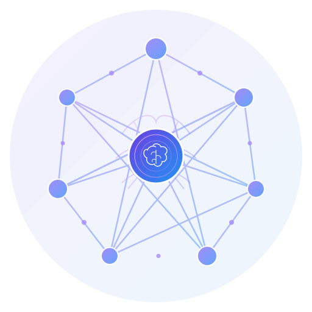

<p align="center">
  
</p>

<h1 align="center">PeerCortex</h1>
<p align="center"><strong>The AI-Powered Network Intelligence Platform</strong></p>

<p align="center">
  <a href="https://www.peeringdb.com/"></a>
  <a href="https://stat.ripe.net/"></a>
  <a href="https://bgp.he.net/"></a>
  <a href="https://modelcontextprotocol.io/"></a>
  <a href="https://ollama.com/"></a>
  <a href="#"></a>
  <a href="#"></a>
  <a href="LICENSE"></a>
</p>

<p align="center">
  AI-powered network intelligence. Query PeeringDB, analyze BGP, monitor RPKI,<br/>
  find peering partners — all from Claude Code or any MCP client. 100% local.
</p>

---

<p align="center">
  
</p>

---

## Table of Contents

- [What is PeerCortex?](#what-is-peercortex)
- [The Problem](#the-problem)
- [Features](#features)
  - [ASN Intelligence](#-asn-intelligence)
  - [Peering Partner Discovery](#-peering-partner-discovery)
  - [BGP Analysis & Anomaly Detection](#-bgp-analysis--anomaly-detection)
  - [RPKI Monitoring & Compliance](#-rpki-monitoring--compliance)
  - [Network Comparison](#-network-comparison)
  - [Report Generation](#-report-generation)
- [MCP Server Tools](#mcp-server-tools)
- [Claude Code Integration](#claude-code-integration)
- [Data Sources](#data-sources)
- [Feature Comparison](#feature-comparison)
- [Architecture](#architecture)
- [Quick Start](#quick-start)
- [Configuration](#configuration)
- [Privacy & Security](#privacy--security)
- [Roadmap](#roadmap)
- [Contributing](#contributing)
- [FAQ](#faq)
- [Acknowledgments](#acknowledgments)
- [Ecosystem](#ecosystem)

---

## What is PeerCortex?

PeerCortex is an **MCP (Model Context Protocol) Server** that unifies six major network intelligence data sources into a single, AI-queryable interface for network engineers, peering coordinators, and NOC operators.

Instead of switching between PeeringDB, RIPE Stat, bgp.he.net, Route Views, IRR databases, and RPKI validators — each with their own interfaces and query languages — PeerCortex lets you ask questions in **plain English** through Claude Code or any MCP-compatible client.

A local **Ollama** instance provides AI analysis: ranking peering partners, detecting BGP anomalies, generating compliance reports, and drafting peering request emails. All inference runs on your machine. No data leaves your network.

**Who is this for?**

- **Network Engineers** who want instant answers from multiple data sources
- **Peering Coordinators** who need to find and evaluate peering partners
- **NOC Operators** who monitor BGP health and detect anomalies
- **Security Teams** who track RPKI compliance and route hijacks
- **Anyone** who works with Internet routing data and wants AI assistance

---

## The Problem

Network operators juggle fragmented tools. Every task requires a different interface:

| Task | Without PeerCortex | With PeerCortex |
|------|-------------------|-----------------|
| ASN lookup | Open PeeringDB, RIPE Stat, bgp.he.net in separate tabs | `"Give me the full picture for AS13335"` |
| Find peering partners | Manual PeeringDB search, filter by IX, check policies | `"Find peering partners at DE-CIX with open policy"` |
| Detect route leaks | Check RIPE RIS, cross-reference AS paths, manual analysis | `"Any BGP anomalies for 185.1.0.0/24?"` |
| RPKI compliance | Query Routinator, match against announced prefixes, calculate coverage | `"Generate an RPKI compliance report for AS13335"` |
| Compare networks | Open both ASNs on PeeringDB, manually compare IX/facility lists | `"Compare AS13335 and AS32934"` |
| Peering request | Look up contacts, check common IXs, write email from scratch | `"Draft a peering request to AS714 for DE-CIX Frankfurt"` |

PeerCortex collapses these multi-step workflows into **single natural language queries**, backed by real data from authoritative sources.

---

## Features

### 1. ASN Intelligence

Unified ASN lookup that queries PeeringDB, RIPE Stat, bgp.he.net, IRR databases, and RPKI validators in parallel, returning a comprehensive network profile.

**What you get:**
- Network name, type, scope, and peering policy
- Announced prefix counts (IPv4 + IPv6)
- IX participation with connection speeds
- Facility/colocation presence
- IRR registration status (as-set, route objects)
- RPKI ROA coverage and validation summary
- Upstream providers and peer count
- Contact information for peering

**Example:**
```
You: Give me the full picture for AS13335

PeerCortex: Here's the comprehensive profile for AS13335 (Cloudflare, Inc.):

  Network Type: Content
  Peering Policy: Open
  Scope: Global
  Prefixes: 1,200+ IPv4, 200+ IPv6
  IXs: 290+ exchanges worldwide
  Facilities: 320+ data centers
  RPKI Coverage: 99.8% (all prefixes covered by ROAs)
  IRR: AS-CLOUDFLARE registered in RADB
  ...
```

### 2. Peering Partner Discovery

AI-ranked peering partner recommendations based on common IX presence, facility overlap, policy compatibility, and network type complementarity.

**What you get:**
- Ranked list of potential peering partners
- Match score with reasoning
- Common IXs and facilities
- Peering policy compatibility
- Contact information
- Draft peering request emails

**Example:**
```
You: Find peering partners for AS13335 at DE-CIX Frankfurt with open policy

PeerCortex: Found 47 networks at DE-CIX Frankfurt with open peering policy.
Top matches for AS13335:

  1. AS32934 (Facebook) — Score: 92/100
     Common IXs: DE-CIX Frankfurt, AMS-IX, LINX
     Common Facilities: Equinix FR5, Interxion FRA
     Policy: Open | Type: Content
     Why: Major content network, high traffic overlap potential

  2. AS15169 (Google) — Score: 88/100
     Common IXs: DE-CIX Frankfurt, AMS-IX, LINX, JPNAP
     ...
```

### 3. BGP Analysis & Anomaly Detection

Real-time BGP analysis using data from RIPE Stat RIS collectors, Route Views, and bgp.he.net. Detects route leaks, BGP hijacks, MOAS conflicts, and path anomalies.

**What you get:**
- AS path analysis and diversity metrics
- Route origin validation
- Anomaly detection with severity levels
- Route leak identification
- BGP hijack alerts
- MOAS (Multiple Origin AS) conflict detection
- Prefix visibility reports
- AI-generated routing assessment

**Example:**
```
You: Are there any BGP anomalies for 185.1.0.0/24 right now?

PeerCortex: BGP analysis for 185.1.0.0/24:

  Origin AS: AS47541
  Path Diversity: 12 unique paths from 24 collectors
  Visibility: 98.5% (seen by 394/400 RIS peers)
  RPKI Status: Valid (ROA match: 185.1.0.0/24, max /24, AS47541)

  Anomalies Detected: None
  No route leaks, hijacks, or MOAS conflicts detected.
  Routing appears stable and healthy.
```

```
You: Show me all route leaks involving my prefixes in the last 7 days

PeerCortex: Analyzing BGP updates for your prefixes over the last 7 days...

  ALERT: 2 route leak events detected

  1. [HIGH] 2026-03-22T14:32:00Z — 203.0.113.0/24
     Leaked by AS64496 via AS64497
     Expected path: AS64496 → AS64498 → origin
     Observed path: AS64496 → AS64497 → AS64499 → origin
     Duration: 23 minutes
     Impact: Partial traffic rerouting through unexpected path
     ...
```

### 4. RPKI Monitoring & Compliance

Comprehensive RPKI validation and compliance monitoring. Validates prefix-origin pairs, generates compliance reports, and identifies networks at IXs without RPKI coverage.

**What you get:**
- Prefix-origin RPKI validation (valid/invalid/not-found)
- ROA coverage percentage for an ASN
- Compliance reports with recommendations
- IX-level RPKI coverage analysis
- Comparison with industry benchmarks
- Step-by-step remediation guidance

**Example:**
```
You: Generate an RPKI compliance report for AS13335

PeerCortex: RPKI Compliance Report — AS13335 (Cloudflare, Inc.)

  Overall Coverage: 99.8%
  Total Announced Prefixes: 1,432
  RPKI Valid: 1,429 (99.8%)
  RPKI Invalid: 0 (0.0%)
  Not Covered: 3 (0.2%)

  Uncovered Prefixes:
    - 198.51.100.0/24 (recently announced, ROA pending)
    - 2001:db8:1::/48 (experimental prefix)
    - 2001:db8:2::/48 (experimental prefix)

  Recommendations:
    1. Create ROAs for the 3 uncovered prefixes
    2. All ROAs have appropriate max-length settings
    3. RPKI-invalid route filtering is recommended on all sessions
  ...
```

```
You: Which ASNs at AMS-IX don't have RPKI?

PeerCortex: RPKI Coverage Analysis — AMS-IX

  Total Participants: 932
  With RPKI Coverage: 714 (76.6%)
  Without RPKI: 218 (23.4%)

  Largest uncovered networks:
    - AS64496 (Example ISP) — 450 prefixes, 0% RPKI coverage
    - AS64497 (Example Transit) — 230 prefixes, 0% RPKI coverage
    ...
```

### 5. Network Comparison

Side-by-side comparison of two autonomous systems across all dimensions: size, IX presence, facility overlap, peering policy, RPKI deployment, and geographic coverage.

**What you get:**
- Side-by-side metrics table
- Common and unique IXs
- Common and unique facilities
- Peering potential score
- AI-generated comparison narrative
- Peering opportunity identification

**Example:**
```
You: Compare AS13335 and AS32934 — where do they peer?

PeerCortex: Network Comparison — AS13335 (Cloudflare) vs AS32934 (Facebook)

  Metric            | AS13335 (Cloudflare) | AS32934 (Facebook)
  ────────────────────────────────────────────────────────────
  Type              | Content              | Content
  Policy            | Open                 | Selective
  IPv4 Prefixes     | 1,200+               | 800+
  IPv6 Prefixes     | 200+                 | 150+
  IX Count          | 290+                 | 180+
  Facility Count    | 320+                 | 60+
  RPKI Coverage     | 99.8%                | 99.5%

  Common IXs (142):
    DE-CIX Frankfurt, AMS-IX, LINX, France-IX, JPNAP, Equinix IX,
    HKIX, SIX Seattle, Any2 Los Angeles, TorIX, ...

  Unique to Cloudflare (148):
    NIX.CZ, BKNIX, KINX, MIX-IT, ...

  Unique to Facebook (38):
    ...

  These networks peer extensively at 142 common IXs worldwide.
```

### 6. Report Generation

Generate presentation-ready reports suitable for NANOG, RIPE, DENOG, or internal meetings. Multiple report types in Markdown, JSON, or plain text.

**Report types:**
- **Peering Readiness** — Evaluates an ASN's readiness for peering
- **RPKI Compliance** — Full RPKI deployment status with remediation steps
- **Network Comparison** — Detailed two-network comparison
- **BGP Health** — Routing health assessment with anomaly history
- **IX Analysis** — Internet Exchange participation analysis

**Example:**
```
You: Generate a peering readiness report for AS13335

PeerCortex: # Peering Readiness Report — AS13335 (Cloudflare, Inc.)

  ## Executive Summary
  AS13335 demonstrates excellent peering readiness with global IX presence,
  open peering policy, and near-complete RPKI coverage...

  ## Key Findings
  - Present at 290+ IXs across 6 continents
  - Open peering policy with clear documentation
  - 99.8% RPKI coverage
  - Active PeeringDB profile with up-to-date contact info
  ...
```

---

## MCP Server Tools

PeerCortex exposes six tools via the Model Context Protocol:

| Tool | Description | Primary Data Sources |
|------|-------------|---------------------|
| `lookup` | ASN, prefix, and IX lookups with unified results | PeeringDB, RIPE Stat, bgp.he.net, IRR, RPKI |
| `peering` | Peering partner discovery and match scoring | PeeringDB, Ollama |
| `bgp` | BGP path analysis and anomaly detection | RIPE Stat, Route Views, bgp.he.net |
| `rpki` | RPKI validation and compliance monitoring | Routinator, RIPE RPKI Validator |
| `compare` | Side-by-side network comparison | PeeringDB, RIPE Stat, RPKI |
| `report` | Generate comprehensive analysis reports | All sources + Ollama |
| `measure_rtt` | RTT measurement via RIPE Atlas probes | RIPE Atlas |
| `traceroute` | Traceroute with ASN annotation and IXP detection | RIPE Atlas, RIPE Stat |
| `upstream_analysis` | Identify and evaluate upstream transit providers | CAIDA, bgp.he.net, RIPE Stat |
| `transit_diversity` | Assess redundancy and single points of failure | CAIDA, Route Views |
| `peering_vs_transit` | Cost/latency comparison of peering vs. transit | PeeringDB, RIPE Stat |
| `as_graph` | AS-level topology graph with relationship types | CAIDA, bgproutes.io |
| `submarine_cables` | Submarine cable lookup by region or landing point | TeleGeography, PeeringDB |
| `facility_analysis` | Colocation presence and interconnection opportunities | PeeringDB |
| `ix_traffic` | IX traffic statistics and historical trends | DE-CIX, AMS-IX, LINX |
| `ix_comparison` | Side-by-side comparison of multiple IXes | DE-CIX, AMS-IX, LINX |
| `port_utilization` | Port utilization analysis with upgrade recommendations | PeeringDB, IX APIs |
| `hijack_detection` | Detect BGP hijacks via RPKI ROV and MOAS analysis | bgproutes.io, RIPE Stat |
| `route_leak_detection_aspa` | ASPA-based route leak detection | bgproutes.io |
| `bogon_check` | Bogon prefix and bogon ASN detection | RIPE Stat, IANA |
| `blacklist_check` | IP/prefix/ASN blacklist and reputation checks | Spamhaus, Team Cymru |
| `reverse_dns` | Batch reverse DNS with FCrDNS verification | Cloudflare DoH |
| `delegation_check` | DNS delegation and DNSSEC validation | Cloudflare DoH |
| `whois_lookup` | Structured WHOIS for IPs, ASNs, and domains | RIPE DB, WHOIS |
| `atlas_create_measurement` | Create RIPE Atlas measurements | RIPE Atlas |
| `atlas_get_results` | Retrieve and summarize measurement results | RIPE Atlas |
| `atlas_search_probes` | Search probes by ASN, country, prefix, or anchor | RIPE Atlas |

Each tool accepts structured input validated by Zod schemas and returns typed JSON responses.

---

## Claude Code Integration

Add PeerCortex to your Claude Code configuration:

```json
{
  "mcpServers": {
    "peercortex": {
      "command": "node",
      "args": ["/path/to/peercortex/dist/mcp-server/index.js"],
      "env": {
        "OLLAMA_BASE_URL": "http://localhost:11434",
        "OLLAMA_MODEL": "llama3.1"
      }
    }
  }
}
```

### Example Conversations

Once configured, you can interact with PeerCortex naturally through Claude Code:

```
You: Give me the full picture for AS13335

Claude: I'll look up comprehensive information for AS13335 using PeerCortex...

[Calls lookup tool with asn=13335]

Here's the complete profile for AS13335 (Cloudflare, Inc.):

Network Overview:
  - Name: Cloudflare, Inc.
  - Type: Content
  - Peering Policy: Open
  - Scope: Global
  - Website: cloudflare.com
  ...
```

```
You: Find peering partners for AS13335 at DE-CIX with open policy

Claude: Let me search for networks at DE-CIX with open peering policy
that would be good matches for Cloudflare...

[Calls peering tool with asn=13335, ix="DE-CIX Frankfurt", policy="open"]

I found 47 potential peering partners at DE-CIX Frankfurt. Here are the
top matches ranked by compatibility...
```

```
You: Are there any BGP anomalies for 185.1.0.0/24 right now?

Claude: I'll analyze the current BGP routing state for that prefix...

[Calls bgp tool with resource="185.1.0.0/24", include_anomalies=true]

Good news — no anomalies detected for 185.1.0.0/24. The prefix is
currently announced by AS47541 with stable routing...
```

```
You: Compare AS13335 and AS32934 — where do they peer?

Claude: Let me pull up a side-by-side comparison of Cloudflare and Facebook...

[Calls compare tool with asn1=13335, asn2=32934]

Here's a detailed comparison of the two networks. They peer at
142 common Internet Exchanges worldwide...
```

```
You: Generate an RPKI compliance report for AS13335

Claude: I'll generate a comprehensive RPKI compliance report...

[Calls rpki tool with asn=13335, include_recommendations=true]

Here's the RPKI compliance report for Cloudflare. They have 99.8%
coverage with only 3 uncovered prefixes...
```

```
You: Which ASNs at AMS-IX don't have RPKI?

Claude: Let me analyze RPKI coverage across AMS-IX participants...

[Calls rpki tool for IX coverage analysis]

Out of 932 AMS-IX participants, 218 (23.4%) don't have RPKI
coverage for their announced prefixes...
```

```
You: Show me all route leaks involving my prefixes in the last 7 days

Claude: I'll scan BGP update data for route leak events...

[Calls bgp tool with anomaly detection]

I found 2 route leak events in the last 7 days affecting your prefixes...
```

```
You: Draft a peering request email to AS714 for DE-CIX Frankfurt

Claude: I'll draft a professional peering request to Apple...

[Calls peering tool to generate email draft]

Here's a ready-to-send peering request email to Apple's peering team
for establishing peering at DE-CIX Frankfurt...
```

```
You: Trace the path from AS32934 (Meta) to Cloudflare (AS13335) and show latency

Claude: I'll create a RIPE Atlas traceroute from Meta's network to Cloudflare...

[Calls traceroute tool with target="1.1.1.1", sourceAsn=32934]

The traceroute from AS32934 to AS13335 shows 8 hops with an average
RTT of 4.2ms. The path crosses DE-CIX Frankfurt at hop 4, where both
networks are present. No IXP-level congestion detected...
```

```
You: Detect route leaks using ASPA validation for prefixes of AS13335

Claude: I'll check all Cloudflare prefixes for ASPA validation failures...

[Calls route_leak_detection_aspa tool with asn=13335]

Checked 1,432 prefixes for AS13335 (Cloudflare). No active route leaks
detected via ASPA validation. AS13335 has ASPA objects registered for
all upstream providers. 2 historical leak events found from the past
90 days, both resolved within 15 minutes...
```

```
You: Show IX traffic trends at DE-CIX Frankfurt for the last 12 months

Claude: I'll fetch DE-CIX Frankfurt traffic statistics with monthly granularity...

[Calls ix_traffic tool with ix="de-cix-frankfurt", period="12m", granularity="monthly"]

DE-CIX Frankfurt traffic over the last 12 months:
  Current Peak: 14.2 Tbps
  Average: 8.7 Tbps
  Year-over-Year Growth: +18.4%
  Connected Networks: 1,100+
  Monthly trend shows consistent growth with seasonal peaks in Q4...
```

```
You: What would change if AS32934 (Meta) peered directly with AS13335 (Cloudflare)
instead of using transit?

Claude: Let me analyze the current path and potential direct peering benefits...

[Calls peering_vs_transit tool with sourceAsn=32934, targetAsn=13335]

Current path: AS32934 → AS174 (Cogent) → AS13335 (3 hops, ~12ms RTT)
With direct peering at DE-CIX Frankfurt: AS32934 → AS13335 (1 hop, ~2ms RTT)

Both networks are present at 142 common IXes and 28 common facilities.
Estimated RTT reduction: 10ms. Direct peering is strongly recommended
given the extensive IX overlap and open peering policies...
```

---

## Data Sources

| Source | URL | Data Provided | Update Frequency |
|--------|-----|---------------|------------------|
| **PeeringDB** | [peeringdb.com](https://www.peeringdb.com/) | Network info, IXs, facilities, contacts | User-maintained (near real-time) |
| **RIPE Stat** | [stat.ripe.net](https://stat.ripe.net/) | BGP state, prefixes, visibility, RPKI | Real-time (RIS collectors) |
| **bgp.he.net** | [bgp.he.net](https://bgp.he.net/) | Peers, upstreams, downstreams, prefixes | Multiple times daily |
| **Route Views** | [routeviews.org](https://www.routeviews.org/) | Global routing table, path diversity | Real-time (via RIPE Stat) |
| **IRR** | [rest.db.ripe.net](https://rest.db.ripe.net/) | Route objects, as-sets, WHOIS | Near real-time |
| **RPKI** | Local Routinator / RIPE RPKI | ROA validation, VRP list | Every ~10 minutes |
| **bgproutes.io** | [bgproutes.io](https://bgproutes.io/) | RIB entries, BGP updates, AS topology, RPKI ROV + ASPA validation | Real-time |
| **RIPE Atlas** | [atlas.ripe.net](https://atlas.ripe.net/) | Ping, traceroute, DNS, SSL measurements from global probes | On-demand |
| **CAIDA AS Rank** | [asrank.caida.org](https://asrank.caida.org/) | AS relationships, customer cones, rankings | Periodic |
| **IX Traffic** | DE-CIX, AMS-IX, LINX public APIs | IX traffic statistics and trends | Near real-time |
| **DNS-over-HTTPS** | Cloudflare/Google DoH | rDNS, delegation, DNSSEC verification | Real-time |

All data is fetched directly from authoritative sources. PeerCortex caches responses locally in SQLite to reduce API calls and improve response times.

---

## Feature Comparison

How PeerCortex compares to existing tools:

| Feature | PeerCortex | bgpq4 | peeringdb-py | ripestat-cli | bgpstream |
|---------|:----------:|:-----:|:------------:|:------------:|:---------:|
| ASN Lookup (unified) | Yes | - | Partial | Partial | - |
| Peering Discovery | AI-ranked | - | Basic | - | - |
| BGP Analysis | Yes | - | - | Yes | Yes |
| Anomaly Detection | AI-powered | - | - | Partial | Yes |
| RPKI Monitoring | Yes | - | - | Partial | - |
| Network Comparison | Yes | - | - | - | - |
| Report Generation | AI-powered | - | - | - | - |
| MCP Integration | Native | - | - | - | - |
| Local AI | Ollama | - | - | - | - |
| Multi-source | 6 sources | 1 (IRR) | 1 (PDB) | 1 (RIPE) | 1 (RIS) |
| Self-hosted | Yes | Yes | Yes | Yes | Yes |
| No cloud dependency | Yes | Yes | Yes | Yes | Yes |

PeerCortex is not a replacement for these excellent tools — it complements them by providing a unified, AI-enhanced interface for the most common network intelligence tasks.

---

## Architecture

```
┌──────────────────────────────────────────────────────────────────┐
│                     MCP Client (Claude Code)                      │
└──────────────────────────┬───────────────────────────────────────┘
                           │ stdio / SSE
┌──────────────────────────▼───────────────────────────────────────┐
│                     PeerCortex MCP Server                         │
│                                                                   │
│  ┌─────────┐ ┌─────────┐ ┌─────┐ ┌──────┐ ┌────────┐ ┌───────┐ │
│  │ lookup  │ │ peering │ │ bgp │ │ rpki │ │compare │ │report │ │
│  └────┬────┘ └────┬────┘ └──┬──┘ └──┬───┘ └───┬────┘ └───┬───┘ │
│       └───────────┴─────────┴───────┴──────────┴──────────┘     │
│                              │                                    │
│  ┌───────────────────────────▼──────────────────────────────────┐│
│  │                Source Aggregation Layer                       ││
│  │  PeeringDB · RIPE Stat · bgp.he.net · Route Views · IRR · RPKI  ││
│  └──────────────────────────────────────────────────────────────┘│
│                                                                   │
│  ┌─────────────────────┐  ┌──────────────────────────────────┐  │
│  │  SQLite Cache        │  │  Ollama (Local AI)               │  │
│  │  Response caching    │  │  Analysis & report generation    │  │
│  └─────────────────────┘  └──────────────────────────────────┘  │
└──────────────────────────────────────────────────────────────────┘
```

For detailed architecture documentation, see [docs/architecture.md](docs/architecture.md).

---

## Quick Start

### Option 1: Docker (Recommended)

```bash
# Clone the repository
git clone https://github.com/peercortex/peercortex.git
cd peercortex

# Copy environment configuration
cp .env.example .env

# Start PeerCortex + Ollama
docker compose up -d

# Pull the AI model
docker exec peercortex-ollama ollama pull llama3.1

# Verify it's running
docker logs peercortex
```

### Option 2: Local Installation

```bash
# Prerequisites: Node.js 20+, Ollama installed

# Clone and install
git clone https://github.com/peercortex/peercortex.git
cd peercortex
npm install

# Configure
cp .env.example .env
# Edit .env with your settings

# Build and start
npm run build
npm start
```

### Option 3: npx (One-liner)

```bash
# Run directly without installing
OLLAMA_BASE_URL=http://localhost:11434 npx peercortex
```

### Configure Claude Code

Add to your Claude Code MCP configuration (`~/.claude.json` or project `.claude.json`):

```json
{
  "mcpServers": {
    "peercortex": {
      "command": "node",
      "args": ["/path/to/peercortex/dist/mcp-server/index.js"],
      "env": {
        "OLLAMA_BASE_URL": "http://localhost:11434",
        "OLLAMA_MODEL": "llama3.1"
      }
    }
  }
}
```

For detailed setup instructions, see [docs/setup.md](docs/setup.md).

---

## Configuration

All configuration is done via environment variables. Copy `.env.example` to `.env` and customize:

| Variable | Default | Description |
|----------|---------|-------------|
| `OLLAMA_BASE_URL` | `http://localhost:11434` | Ollama API endpoint |
| `OLLAMA_MODEL` | `llama3.1` | LLM model for AI analysis |
| `PEERINGDB_API_KEY` | _(empty)_ | Optional PeeringDB API key for higher rate limits |
| `RIPE_STAT_SOURCE_APP` | `peercortex` | RIPE Stat source app identifier |
| `ROUTINATOR_URL` | `http://localhost:8323` | Local RPKI validator URL |
| `RIPE_RPKI_VALIDATOR_URL` | `https://rpki-validator.ripe.net/api/v1` | RIPE RPKI fallback |
| `CACHE_DB_PATH` | `./peercortex-cache.db` | SQLite cache file location |
| `CACHE_TTL_SECONDS` | `3600` | Cache time-to-live (1 hour) |
| `MCP_TRANSPORT` | `stdio` | MCP transport: `stdio` or `sse` |
| `MCP_PORT` | `3100` | Port for SSE transport |
| `LOG_LEVEL` | `info` | Log level: `debug`, `info`, `warn`, `error` |

### Recommended Ollama Models

| Model | Size | Best For |
|-------|------|----------|
| `llama3.1` | 8B | General analysis (recommended default) |
| `llama3.1:70b` | 70B | Deep analysis (requires 40GB+ RAM) |
| `mistral` | 7B | Fast analysis, good quality |
| `codellama` | 7B | Technical report generation |
| `mixtral` | 8x7B | Complex multi-source analysis |

---

## Privacy & Security

PeerCortex is designed for privacy-conscious network operators:

- **100% Local AI**: All inference runs on your machine via Ollama. No data is sent to OpenAI, Anthropic, Google, or any other cloud AI service.
- **No Telemetry**: PeerCortex does not collect or transmit any usage data.
- **No Account Required**: Works without any API keys (PeeringDB key is optional for higher rate limits).
- **Local Cache**: All cached data is stored in a local SQLite database on your machine.
- **Open Source**: Full source code available for audit. MIT license.

**Data flow:**
1. Your query goes from Claude Code to the local PeerCortex MCP server
2. PeerCortex queries public APIs (PeeringDB, RIPE Stat, etc.) for factual data
3. Ollama (running locally) analyzes the data
4. Results are returned to Claude Code

At no point does your query content, network topology, or analysis results leave your machine for AI processing.

---

## ASPA Intelligence

### What is ASPA?

**Autonomous System Provider Authorization (ASPA)** is an RPKI-based mechanism defined in [RFC 9582](https://www.rfc-editor.org/rfc/rfc9582) that enables detection and prevention of route leaks. While RPKI ROA (Route Origin Authorization) validates who is authorized to **originate** a prefix, ASPA validates the **path** a route takes through the Internet.

Each AS publishes an ASPA object declaring its authorized upstream providers. When a BGP router receives a route, it can walk the AS path and verify that each customer-to-provider hop is authorized. Unauthorized hops indicate a route leak — a common and damaging class of BGP incidents.

**Why it matters:**

- Route leaks caused by misconfigured BGP sessions are responsible for major Internet outages every year
- ASPA provides cryptographic proof of provider relationships, complementing ROA validation
- Together, ROA + ASPA cover the two most important BGP security gaps: origin validation and path validation
- ASPA is particularly effective against lateral ISS-ISS leaks and customer-to-provider leaks (RFC 7908)

### ASPA Tools

PeerCortex provides 6 ASPA-focused tools:

| Tool | Description |
|------|-------------|
| `peercortex_aspa_validate` | Validate an AS path against ASPA objects (RFC 9582 Section 6 algorithm) |
| `peercortex_aspa_analyze` | Full ASPA readiness analysis — existing objects, detected providers, recommendations |
| `peercortex_aspa_generate` | Auto-generate a RIPE DB ASPA object template from BGP data |
| `peercortex_aspa_simulate` | "What-if" simulation: how many incidents would ASPA have prevented? |
| `peercortex_aspa_coverage` | ASPA adoption statistics per IXP or geographic region |
| `peercortex_aspa_leaks` | Real-time route leak detection using ASPA validation |

### Example Conversations

**Analyze ASPA readiness:**
```
You: Analyze ASPA readiness for AS13335
Claude: AS13335 (Cloudflare) currently has no registered ASPA object. Based on BGP path
        analysis, the detected upstream providers are AS174 (Cogent) and AS3356 (Lumen).
        Recommendation: Register an ASPA object listing these providers via the RIPE DB.
```

**Generate an ASPA object:**
```
You: Generate an ASPA object for AS13335
Claude: Here is a RIPE DB-ready ASPA template for AS13335:

        aut-num:      AS13335
        upstream:     AS174    # Cogent (confidence: 95%)
        upstream:     AS3356   # Lumen (confidence: 90%)
        mnt-by:       MNT-CLOUDFLARE
        source:       RIPE

        Submit at: https://apps.db.ripe.net/db-web-ui/webupdates
```

**What-if simulation:**
```
You: What would ASPA have prevented in the last 30 days?
Claude: Analyzing 15 BGP incidents from the last 30 days...
        ASPA would have prevented 11 of 15 incidents (73% prevention rate).
        - Route leaks: 8/10 prevented
        - Hijacks: 2/3 prevented
        - Misconfigurations: 1/2 prevented
```

**IXP adoption:**
```
You: Show ASPA adoption at DE-CIX Frankfurt
Claude: DE-CIX Frankfurt ASPA Coverage:
        - Total participants: 950
        - With ASPA objects: 85 (8.9%)
        - Top adopters: AS13335 (Cloudflare), AS32934 (Meta), AS15169 (Google)
```

**Leak detection:**
```
You: Detect route leaks using ASPA for 1.1.1.0/24
Claude: Analyzing last 24 hours of BGP updates for 1.1.1.0/24...
        Found 3 route leak events:
        - CRITICAL: AS64501 leaked 1.1.1.0/24 to AS3356 (17:42 UTC)
        - HIGH: AS64502 re-originated 1.1.1.0/24 (03:15 UTC)
        - MEDIUM: AS64503 lateral leak to AS6939 (21:08 UTC)
```

**Deployment simulation:**
```
You: Simulate: what if all DE-CIX members deployed ASPA?
Claude: If all 950 DE-CIX Frankfurt members deployed ASPA:
        - Route leak prevention rate would increase from 8.9% to ~92%
        - An estimated 340 route leak incidents per year would be prevented
        - Critical incidents (affecting /8 or larger) would drop by 95%
```

---

## Roadmap

### v0.1 — Foundation (Current)
- [x] Project structure and type definitions
- [x] MCP server with 6 tool definitions
- [x] PeeringDB API client
- [x] RIPE Stat API client
- [x] bgp.he.net scraper skeleton
- [x] Route Views / RIPE RIS client
- [x] IRR / WHOIS client
- [x] RPKI validator client
- [x] Ollama AI integration
- [x] SQLite cache layer
- [ ] Complete tool implementations
- [ ] Unit and integration tests

### v0.2 — Core Features
- [ ] Full ASN lookup with all sources
- [ ] Peering partner scoring algorithm
- [ ] BGP anomaly detection engine
- [ ] RPKI compliance reporting
- [ ] Network comparison logic
- [ ] Report templates (Markdown, JSON)

### v0.3 — Intelligence
- [ ] AI-powered anomaly classification
- [ ] Peering request email generation
- [ ] Historical trend analysis
- [ ] Route leak correlation
- [ ] RPKI deployment tracking over time

### v0.4 — Production
- [ ] SSE transport support
- [ ] Webhook alerts for anomalies
- [ ] Prometheus metrics endpoint
- [ ] Comprehensive test suite (80%+ coverage)
- [ ] Performance optimization
- [ ] npm package publishing

### Future
- [x] bgproutes.io integration (ASPA validation support)
- [ ] BGP community analysis
- [ ] Traffic estimation from prefix visibility
- [ ] Peering ROI calculator
- [ ] Multi-language report generation
- [ ] Web dashboard (optional)
- [ ] Slack/Discord bot integration
- [ ] PeeringDB write API (submit peering requests)

---

## Contributing

Contributions are welcome! PeerCortex is built by network engineers, for network engineers.

### Getting Started

```bash
# Fork and clone
git clone https://github.com/YOUR_USERNAME/peercortex.git
cd peercortex

# Install dependencies
npm install

# Run in development mode (auto-reload)
npm run dev

# Run tests
npm test

# Type checking
npm run typecheck

# Linting
npm run lint
```

### Contribution Guidelines

1. **Fork** the repository
2. **Create** a feature branch (`git checkout -b feat/amazing-feature`)
3. **Write tests** for your changes
4. **Ensure** all tests pass and types check
5. **Commit** using conventional commits (`feat:`, `fix:`, `docs:`, etc.)
6. **Push** your branch and open a Pull Request

### Areas Where Help is Needed

- **bgp.he.net scraper**: Improve HTML parsing for all data tabs
- **Anomaly detection**: Implement route leak and hijack detection algorithms
- **RPKI compliance**: Complete the compliance reporting logic
- **Test coverage**: Unit and integration tests for all modules
- **Documentation**: Examples, tutorials, and API documentation
- **Performance**: Optimize parallel data source queries

---

## FAQ

**Q: Do I need an Ollama instance to use PeerCortex?**
A: Ollama is recommended for AI-powered features (analysis, ranking, report generation) but not strictly required. The data lookup tools (lookup, bgp, rpki) work without AI — they return raw structured data that Claude Code can interpret directly.

**Q: Which Ollama model should I use?**
A: `llama3.1` (8B) is the recommended default. It provides excellent analysis quality while running on most hardware. For deeper analysis, try `llama3.1:70b` if you have 40GB+ RAM.

**Q: Does PeerCortex send my data to the cloud?**
A: No. All AI inference runs locally via Ollama. PeerCortex queries public APIs (PeeringDB, RIPE Stat, etc.) for factual network data, but your queries and analysis results never leave your machine.

**Q: Can I use this without Claude Code?**
A: Yes! PeerCortex is a standard MCP server. It works with any MCP-compatible client, including Claude Desktop, custom MCP clients, or direct stdio interaction.

**Q: How accurate is the BGP anomaly detection?**
A: PeerCortex uses data from RIPE RIS collectors and Route Views, which are the same data sources used by academic BGP monitoring systems. AI analysis adds context but all findings are based on real routing data.

**Q: Can I use this for production monitoring?**
A: PeerCortex v0.x is designed for interactive querying and analysis. Production monitoring with alerting is planned for v0.4+. For now, it complements (not replaces) production monitoring tools like BGPalerter.

**Q: What about IPv6?**
A: Full IPv6 support. All tools handle both IPv4 and IPv6 prefixes, and PeeringDB data includes IPv6 IX addresses.

**Q: How do I get a PeeringDB API key?**
A: Create an account at [peeringdb.com](https://www.peeringdb.com/), go to your profile settings, and generate an API key. It's free and gives you higher rate limits.

**Q: Can I run PeerCortex behind a firewall?**
A: Yes, with some considerations. PeerCortex needs outbound HTTP access to PeeringDB, RIPE Stat, bgp.he.net, and optionally RIPE RPKI. If you run Routinator locally, RPKI validation works fully offline. Ollama runs entirely local.

---

## Acknowledgments

PeerCortex is built on the shoulders of these incredible projects and organizations:

- **[PeeringDB](https://www.peeringdb.com/)** — The freely available, user-maintained database of networks. Thank you to PeeringDB Inc. and all contributors who keep peering data open and accessible.
- **[RIPE NCC](https://www.ripe.net/)** — For RIPE Stat, RIPE RIS, and the RIPE Database. Essential infrastructure for Internet measurement and analysis.
- **[Route Views](https://www.routeviews.org/)** — University of Oregon's Route Views project for global routing table collection.
- **[Ollama](https://ollama.com/)** — Making local AI accessible and easy to run.
- **[NLnet Labs](https://nlnetlabs.nl/)** — For Routinator and advancing RPKI deployment.
- **[Hurricane Electric](https://he.net/)** — For bgp.he.net, an invaluable BGP toolkit.
- **[Model Context Protocol](https://modelcontextprotocol.io/)** — Anthropic's MCP specification enabling AI tool integration.

---

## Ecosystem

### Part of the Cortex Family

PeerCortex is part of a growing ecosystem of AI-powered MCP tools:

| Project | Description |
|---------|-------------|
| **[PaperCortex](https://github.com/papercortex/papercortex)** | AI-powered academic paper management and research assistant |
| **PeerCortex** | AI-powered network intelligence platform (you are here) |

Each Cortex project follows the same philosophy: **local AI, open source, privacy-first, MCP-native**.

---

<p align="center">
  <strong>PeerCortex</strong> — Network intelligence, unified.<br/>
  <sub>Built with care for the network engineering community.</sub>
</p>

<!-- SEO: peeringdb tool, bgp analysis, bgp monitoring, peering automation, rpki monitoring,
rpki compliance, network intelligence, asn lookup, prefix lookup, ix peering, internet exchange,
peering partner, route leak detection, bgp hijack detection, mcp server networking,
claude code networking, network operator, noc tools, peering coordinator, ripe stat,
route views, irr query, bgp anomaly, self-hosted network monitoring, local ai networking -->
